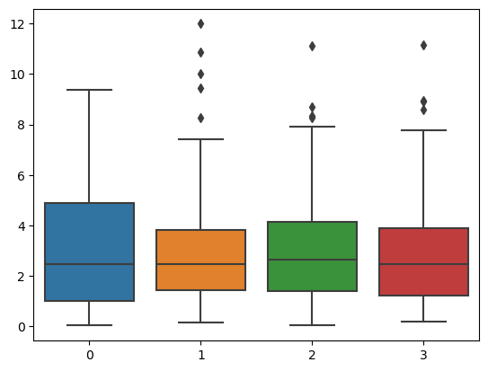

## 基本概念

1. 统计学

    统计学是一门研究收集和分析受随机效应影响的数据的学科。其基本工具是概率论。

2. 总体和个体

    总体是所研究对象的全体，总体是一个[多重集](https://mathworld.wolfram.com/Multiset.html)。

    在统计学中，总体和一个分布在语义上是等价的，我们说从某总体中抽样等价于它服从的分布中抽样。总体可以用一个随机变量表示。

    > 将总体和分布等价只是为了语义上的方便。总体是一个确定的集合，而分布是一个函数，二者显然是不同的。但是抽样的过程具有随机性，因此从总体中抽取样本和产生一个服从某分布的随机数是一样的。

    数理统计中将以无限总体为主要研究对象。在现实中，不可能有真正无限的总体，但是总的来说，只要样本容量远远小于总体容量，那么就可以把总体视为无限的（例如质检）。

    个体是总体中的元素。

3. 样本

    从总体中抽取的n个个体的全体称为样本，也叫样本集，n称为样本量，样本中的个体称为样品。

4. 简单随机抽样

    简单随机抽样是最简单也常见的抽样方法。数理统计中不加特别说明时，都进行简单随机抽样。它需要满足两个要求

    1. 代表性，也叫等可能性，即总体中的每个个体被抽中的概率是相等的
    2. 独立性，从总体中抽样时不能干扰其他的实验的抽样，这意味着样品之间是相互独立的。

## 经验分布函数

假设一个样本集$\{x_1,x_2,\cdots,x_n\}$（基本上，我们的样本集总是有限的）被由小到大进行排列$(x_{(1)},x_{(2)},\cdots,x_{(n)})$，其中，$x_{(k)}\leq x_{(k+1)}$，利用该元组定义下面的函数

$$
F_n(x)=\left\{
\begin{aligned}
&0,&&\text{ if }x<x_{(1)}\\
&k/n,&&\text{ if }x_{(k)}\leq x<x_{(k+1)}\\
&1,&&\text{ if }x\geq x_{(n)}
\end{aligned}\right.
$$

可以看出$F_n(x)$满足分布函数的三条性质：

1. 非减性
2. 右连续性
3. 满足$F(-\infty)=0,F(+\infty)=1$

因此它是一个分布函数，被称为该样本的经验分布函数。

经验分布函数有一个利于编程和计算的写法

$$
F_n=\dfrac 1n\sum_{i=1}^n I(x\geq x_{i})
$$

其中$I(q)$是示性函数，在其中的条件为真时等于1，否则等于0.

利用这个定义，只需几行Python代码即可定义出经验分布函数

```python
def ecdf(x: float, sample: list[float]) -> float:
    return sum(1 for s in sample if x >= s)/len(sample)
```

这种算法的时间复杂度为o(mn)，m为待计算数据的规模，n为样本规模。而原定义的一个较好的平均时间复杂度为o((n+m)logn)，在待计算数据较少时使用前者是好的，在待计算数据较多时后者是好的。

经验分布有一个重要的性质（Glivenko-Cantelli 定理）：

$$P\left(\lim_{n\to\infty}\sup_{x\in R}|F_n(x)-F(x)| =0\right)=1
$$

其中$F(x)$是总体分布函数。

所以经验分布函数是总体分布函数的一个良好近似。

我使用Python生成了100个标准正态随机数并绘制了它们的经验分布函数，以及标准正态分布的分布函数。

```python
import numpy as np
import seaborn as sns
from scipy.stats import norm
np.random.seed(100)
data1=np.random.normal(size=100)
data2=norm.cdf(np.arange(start=-3,stop=3,step=1e-3))
sns.displot(data1,kind="ecdf",color="red")
sns.lineplot(y=data2,x=np.arange(start=-3,stop=3,step=1e-3))
```


## 统计量及其分布

统计量是不含总体信息的样本函数。

统计量也会服从一类分布。

假设$x_1,x_2,\cdots,x_n$为样本。

### 样本均值

$$
\overline x=\dfrac 1n\sum_{i=0}^n x_i
$$

性质

1. 偏差值和为 0

    $$
    \sum_{i=1}^n (x_i-\overline x)=0
    $$

2. 偏差平方和最小

    $$
    \sum_{i=1}^n (x_i-c)^2\geq\sum_{i=1}^n (x_i-\overline x)^2
    $$

    其中 $c$ 为任意常数，当且仅当 $c=\overline x$ 时上式取等号

分布

如果总体服从均值和方差分别为 $\mu,\sigma^2$ 的正态分布，那么均值 $\overline x\sim N(\mu,\sigma^2/n)$

如果总体不服从或不知道服不服从正态分布，但均值和方差存在且为 $\mu,\sigma^2$ 那么均值 $\overline x\dot\sim N(\mu,\sigma^2/n)$，其中 $\dot\sim$ 意为渐进分布。

### 样本方差

也叫无偏样本方差

$$
s^2=\dfrac{1}{n-1}\sum_{i=1}^n(x_i-\overline x)^2
$$

也常用样本标准差 $s=\sqrt{s^2}$ 度量样本散布大小，因为它和样本具有相同的量纲。

性质

如果总体 $X$ 具有二阶矩，且 $EX=\mu,VarX=\sigma^2$，那么

1. $$E(\overline x)=\mu,Var(\overline x)=\sigma^2/n$$

2. $$E(s^2)=\sigma^2$$
3. 如果总体服从正态分布，$\overline x$ 与 $s^2$ 相互独立
4. 如果总体服从正态分布，那么 $\dfrac{(n-1)s^2}{\sigma^2}\sim\chi^2(n-1)$

### 样本矩

1. $k$阶样本原点矩

    $$
    a_k=\dfrac 1n\sum_{i=1}^n x_i^k
    $$

2. $k$阶样本中心矩

    $$
    b_k=\dfrac 1n\sum_{i=1}^n (x_i-\overline x)^k
    $$

    2阶样本中心距是样本方差，但是是有偏的版本，在矩估计时，我们使用*有偏的那个方差*估计样本方差。

3. 样本偏度，三阶矩除以有偏标准差的三次方

    $$
    \hat\beta_S=b_3/b_2^{3/2}
    $$

4. 样本峰度，四阶矩除以有偏标准差的四次方减去标准正态分布的值

    $$
    \hat\beta_k=b_4/b_2^2-3
    $$

样本矩和随机变量矩实际上没有什么差别。

### 次序统计量

次序统计量是一个很重要的统计量，特别是在非参数统计中，本质上，这是利用了分布函数不减的性质。

假设一个样本集$\{x_1,x_2,\cdots,x_n\}$被由小到大进行排列为$(x_{(1)},x_{(2)},\cdots,x_{(n)})$，其中，$x_{(k)}\leq x_{(k+1)}$，该元组称为样本的次序统计量，元组中元素的下标称为元素的秩。

假设总体的分布函数为 $F(x)$，概率密度函数为 $p(x)$，随机变量 $X\sim B(n,F(x))$（只是形式上的服从，为了方便记忆），那么第 $k$ 个次序统计量 $x_{(k)}$ 的密度函数为

$$
p_k(x)=\dfrac{kP(X=k)}{F(x)}p(x)
$$

或者展开

$$
p_k(x)=\dfrac{k}{F(x)}\begin{pmatrix}n\\ k\end{pmatrix}(F(x))^k(1-F(x))^{n-k}p(x)
$$

特别地，最大值和最小值的分布分别为

$$
\begin{aligned}
p_1(x)&=n(1-F(x))^{n-1}p(x)\\
p_n(x)&=n(F(x))^{n-1}p(x)
\end{aligned}
$$

次序统计量的联合分布使用得很少，记忆起来也有一定的困难，因此我不列出来，请感兴趣的读者自行查阅。

### 样本极差

样本极差 $R_n=x_{(n)}-x_{(1)}$

样本极差的分布是样本最大值与最小值的联合分布，可以使用卷积进行计算，不过大部分时候都是一个没有初等解只有数值解的函数，大家可以自行推导均匀分布的极差统计量的分布，这个分布是有初等解的，可以前往 [Wikipedia](https://en.wikipedia.org/wiki/Order_statistic#The_joint_distribution_of_the_order_statistics_of_the_uniform_distribution) 查看答案。

### 样本中位数和 $\pi$ 分位数

中位数

$$
m_{0.5}=\left\{\begin{aligned}
&x_{(\frac{n+1}{2})},&&\text{if }n\text{ is odd}\\
&(x_{(\frac{n}{2})}+x_{(\frac{n}{2}+1)})/2,&&\text{if }n\text{ is even}
\end{aligned}\right.
$$

样本 $\pi$ 分位数

$$
m_\pi=\left\{\begin{aligned}
&x_{(\lceil n\pi\rceil)},&&\text{if }n\text{ is not an integer}\\
&(x_{(n\pi)}+x_{(n\pi+1)})/2,&&\text{if }n\text{ is an integer}
\end{aligned}\right.
$$

#### 箱线图

利用五数概括 $x_{(1)},m_{0.25},m_{0.5},x_{(n)}$ 生成的图形叫箱线图，利用 Python 可以方便地绘制箱线图。

箱线图可以方便地查看数据的聚集趋势。体现峰度和偏度。

下面是一组卡方随机数所生成的箱线图。

```python
import numpy as np
import seaborn as sns
%matplotlib inline

data=np.random.chisquare(df=3,size=(100,4))
sns.boxplot(data)
```



自由度为3的卡方分布的0.5分位数约为2.36，由上图可以看出样本中位数确实具有稳健性。

## 三大抽样分布

有三个统计量具有很广泛的应用。

|统计量|期望|方差|
|---|---|---|
|$\chi^2=\sum x_n^2$|n|2n|
|$F=\dfrac{\sum y_i^2/m}{\sum x_i^2/n}$|n/(n-2)|$\dfrac{2n^2(m+n-2)}{m(n-2)^2(n-4)}$|
|$t=\dfrac{y_1}{\sqrt{\sum x_i^2/n}}$|0|n/(n-2)|

它们具有明确的概率密度函数，但是比较复杂，我不会在这里列出。

卡方分布用来拟合样本方差，因为如果样本来自正态总体，那么样本方差和总体方差有如下关系

$$
(n-1)\dfrac{s^2}{\sigma^2}\sim\chi^2(n-1)
$$

$F(m,n)$分布有如下重要性质：

1. $F(m,n)=\dfrac{1}{F(n,m)}$
2. $F_\alpha(m,n)=\dfrac{1}{F_{1-\alpha}(n,m)}$

F分布用来拟合两总体的样本方差之比

$$
\dfrac{s_x^2/\sigma_1^2}{s_y^2/\sigma_2^2}\sim F(m-1,n-1)
$$

自由度为1的t分布就是柯西分布，均值不存在。

自由度大于1时期望存在且为0

自由度大于2时方差存在，为 n/(n-2)

自由度大于30时可以用正态分布近似计算。

t分布给出了小样本时以中心极限定理形式的统计量服从的分布，即

$$
\dfrac{\sqrt n(\bar x-\mu)}{s}\sim t(n-1)
$$

还能给出两个正态总体相减的分布

$$
\begin{aligned}
&\text{let }s_w^2=\dfrac{(m-1)s_x^2+(n-1)s_y^2}{m+n-2},\\
&\text{then }\dfrac{(\bar x-\bar y)-(\mu_1-\mu_2)}{s_w\sqrt{\dfrac 1m+\dfrac 1n}}\sim t(m+n-2)
\end{aligned}
$$

## 充分统计量

总体分布族为 $F(x;\boldsymbol\theta)$，如果给定统计量 $T(\vec x)$，使得 $\vec x$ 的条件分布与 $\boldsymbol\theta$ 无关。那么 $T(\vec x)$ 是一个充分统计量。其中，$T,\vec x,\boldsymbol\theta$ 是向量。

### 因子分解定理

如果样本的联合分布函数 $f(\vec x)=g(T(\vec x);\boldsymbol\theta)h(\vec x)$，其中 $g(T(\vec x);\boldsymbol\theta),h(\vec x)$ 为任意的函数，那么统计量 $T$ 是充分的。上述条件是互为充要的。

## 分布的参数和参数估计

在进行统计推断的过程中，总体的分布总是未知的，我们的任务是通过有限的样本获得尽可能多的总体信息。

但是在一些情况下，总体的分布族是已知的，只有其中的部分参数未知，例如误差服从正态分布，等待的时间服从指数分布等等。这种获取参数的统计推断，叫做参数估计。

约定总体分布族 $F(x;\boldsymbol\theta),\boldsymbol\theta\in\varTheta$ 中的参数 $\boldsymbol\theta$ 未知，其中，$\varTheta$ 叫做参数空间，是已知的。

## 点估计

给出参数的估计数值的过程叫做点估计，顾名思义，给出的是一个点。

利用统计量 $\hat\theta=T(\vec x)$ 给出估计值。

如果对于估计量有 $E_\theta(\hat\theta)=\theta$，那么称估计量 $\hat\theta=T(\vec x)$ 为无偏估计，否则称为有偏估计。

无偏估计不具有不变性，即如果 $\hat\theta$ 是参数 $\theta$ 的一个无偏估计，那么 $g(\hat\theta)$ **不一定**是 $g(\theta)$ 的无偏估计。

如果参数存在无偏估计，那么称它为可估的，否则为不可估的。

对于两个无偏估计量 $\hat\theta_1,\hat\theta_2$，如果

$$
\begin{aligned}
\forall\ \theta\in\varTheta,Var(\hat\theta_1)\leq Var(\hat\theta_2),\\
\exists\ \theta\in\varTheta,Var(\hat\theta_1)\lt Var(\hat\theta_2).
\end{aligned}
$$

那么称 $\hat\theta_1$ 比 $\hat\theta_2$ 有效。

## 矩估计

1. 可以用样本矩替换总体矩
2. 可以用样本矩的函数替换总体矩的函数

上述方法称为参数的矩估计。

## 相合性

$$
\hat\theta\stackrel{P}{\longrightarrow}\theta
$$

展开

$$
\forall\varepsilon>0,\lim_{n\to\infty}P(|\hat\theta-\theta| \geq\varepsilon)=0
$$

即随着样本量的增大，估计量能够把被估参数收敛到任意精度。

点估计必须具有相合性。

相合性具有不变性，即如果 $\hat\theta$ 是参数 $\theta$ 的一个相合估计，那么 $g(\hat\theta)$是 $g(\theta)$ 的相合估计。

在一般情况下，矩估计都具有相合性。

## 最大似然估计（MLE）

假设样本的联合概率密度函数为

$$
L(\vec x;\theta)=\prod p(x_i;\theta)
$$

如果将其看作关于参数的函数，那么它的最大值点的意义就是：如果参数取得最大值点，那么样本最有可能出现当前的组合。

因此将最大值点作为参数的一个估计是可行的，这个估计叫做极大似然估计（**M**aximum **L**ikelihood **E**stimate, MLE)。

求极大似然估计的步骤：

1. 写出样本联合分布函数

    $$
    L(\theta;\vec x)=\prod p(x_i;\theta)
    $$

2. 求对数 $\ln L=\sum\ln p(x_i;\theta)$
3. 求导数并令其等于零

    $$
    \dfrac{\partial\ln L}{\partial\theta}=\sum\dfrac{p'(x_i;\theta)}{p_i(x_i;\theta)}=0
    $$

4. 解方程，方程的解即为MLE

似然函数 $L$ 并不总是可以求导，在不能求导的时候，就要使用不同的办法求得似然函数的最大值。

MLE具有不变性，即如果 $\hat\theta$ 是 $\theta$ 的MLE，那么 $g(\hat\theta)$ 是 $g(\theta)$ 的MLE

MLE具有渐进正态性，即存在一个非负数列 $\{\sigma_n(\theta)\}$，使得

$$
\dfrac{\hat\theta-\theta}{\sigma_n(\theta)}\stackrel{L}{\longrightarrow}N(0,1)
$$

其中 $\sigma_n^2$ 称作渐近方差。

### 求MLE的EM算法（选读）

有时根据上面的的方法不能或很难求出MLE，让我们看看下面的例子。

总体的分布列为

|$X$|1|2|3|4|
|---|---|---|---|---|
|$P$|$\dfrac{2-\theta}4$|$\dfrac{1-\theta}{4}$|$\dfrac{1+\theta}{4}$|$\dfrac\theta4$|

实验进行了197次，四种结果分别出现了75, 18, 70, 34次（分别用 $y_1,y_2,y_3,y_4$ 表示）。

使用前面的方法求本例的MLE是困难的，因为结果会出现三次多项式，请读者自行尝试。

但是我们可以构建“潜变量”来简化计算。

将结果1分成两部分，第一部分的概率为 $\dfrac{1-\theta}4$（参数小于1是显然的），出现次数用 $z_1$ 表示，那么第二部分的概率为 $\dfrac 14$，出现次数为 $y_1-z_1$。

将结果3也分为两部分，概率分别为 $\dfrac\theta4,\dfrac14$，次数分别为 $z_3,y_3-z_3$。

其中 $z_1,z_3$ 是我们设定的中间变量，即上文所提的潜变量。

那么对数似然函数为

$$
\ln L(\theta)\propto(z_2+y_4)\ln\theta+(z_1+y_2)\ln(1-\theta)
$$

如果将 $z_i$ 看作随机变量，那么它服从 $B(y_i,P(Z_i|X=y_i)),i=1,3$。

那么如果 $\theta$ 已知，就可以求出 $z_i$ 的期望，并且这是与其无关的。因此，我们可以假定 $\theta$ 的初值为 $\theta'$，然后迭代求解。

在本例中，两个潜变量没有耦合，可以同时求期望。

$$
E_z(\ln L)=\left(\dfrac{\theta'}{1+\theta'}y_3+y_4\right)\ln\theta+\left(\dfrac{1-\theta'}{2+\theta'}y_1+y_2\right)\ln\theta
$$

对于上式求导，然后令其为零，可以得到迭代公式。

$$
\theta=\dfrac{\dfrac{\theta'}{1+\theta'}y_3+y_4}{\dfrac{\theta'}{1+\theta'}y_3+y_4+\dfrac{1-\theta'}{2+\theta'}y_1+y_2}
$$

用 $\theta^{(n)},\theta^{(n-1)}$ 分别替换 $\theta,\theta'$，即可得到 $\theta^{(n)}=g(\theta^{(n-1)})$

如果给定初值 $\theta^{(1)}=0.5$，那么在经过13次迭代后得到MLE的数值解，误差控制在1e-6之内。

## 最小方差无偏估计

[知乎 - Data Hacker 的专栏 1](https://zhuanlan.zhihu.com/p/147971437)

[知乎 - Data Hacker 的专栏 2](https://zhuanlan.zhihu.com/p/148147126)

## 贝叶斯估计简介

统计学有两个大的学派：经典学派和贝叶斯学派。

他们最大的不同在于对于先验信息利用的不同上。

贝叶斯学派认为，未知参数也应当视为一个随机变量，可用一个概率分布描述。这个分布被称为未知参数的先验分布，常用 $\pi(\theta)$ 来表示。这一点也得到了经典学派的认可。

以贝叶斯的观点来看，总体的分布应当写为 $F(x|\theta)$ 而不是 $F(x;\theta)$，也就是应当用条件概率来表示。

在实际问题中，先验分布的确定是很难的，要综合运用现有经验和资料。

### 贝叶斯公式的密度函数形式

$$
\pi(\theta\mid X)=\dfrac{p(X\mid\theta)\pi(\theta)}{\int_\varTheta p(X\mid\theta)\pi(\theta)\mathrm d\theta}
$$

上述等式右端的条件分布被称为 $\theta$ 的后验分布，它归结了来自样本、总体和先验的所有信息。

使用后验分布来进行 $\theta$ 的估计是贝叶斯学派的基本观点，估计值一般被记为 $\hat\theta_B$.

如果实在没有任何先验信息，我们应当采用同等无知原则，即假设 $\theta$ 服从参数空间上的均匀分布。

## 区间估计

区间估计给出了参数可能存在的区间。

先来看看点估计的不足，以此理解我们为什么必须引入区间估计。

如果参数空间是一个连续的集合，点估计就不能给出估计的精度（因为都是 0），只有区间才可以。

我们依旧使用概率来描述区间估计的精度。联系贝叶斯学派的观点，这也是我们必须承认 $\theta$ 是一个随机变量的原因之一。

### 置信水平

置信水平描述了参数落入我们给出的区间的概率大小，描述了结果的精度，如果用数学语言讲述，就是：

如果区间 $[\hat\theta_L,\hat\theta_M]$ 的置信水平为 $1-\alpha$，那么

$$
P(\hat\theta_L\leq\theta\leq\hat\theta_M)\geq1-\alpha
$$

其中，$\hat\theta_L$ 被称为置信下限，$\hat\theta_M$ 被称为置信上限。

至于为什么使用 $1-\alpha$ 而不是直接使用 $\alpha$，是为了与后文的概念统一，我们将留待后文再提。

根据概率的性质我们知道：$1-\alpha$ 置信区间不是唯一的，拥有同等置信度的置信区间被称为 **$\boldsymbol{1-\alpha}$ 同等置信区间**。

同等置信区间中，置信上限有大有小，但是当置信上限取 $+\infty$ 时，置信下限是最大的，此时的置信下限被称为（单侧）置信下限。

反之，当置信下限取 $-\infty$ 时，置信上限是最小的，此时的置信下限被称为（单侧）置信上限。
