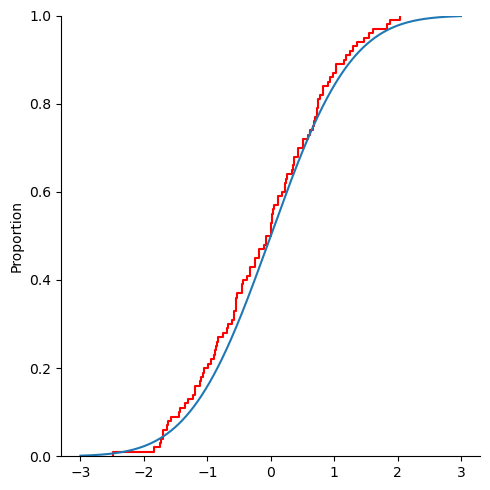

## 基本概念

1. 统计学

    统计学是一门研究收集和分析受随机效应影响的数据的学科。其基本工具是概率论。

2. 总体和个体

    总体是所研究对象的全体，总体是一个[多重集](https://mathworld.wolfram.com/Multiset.html)。

    在统计学中，总体和一个分布在语义上是等价的，我们说从某总体中抽样等价于它服从的分布中抽样。总体可以用一个随机变量表示。

    > 将总体和分布等价只是为了语义上的方便。总体是一个确定的集合，而分布是一个函数，二者显然是不同的。但是抽样的过程具有随机性，因此从总体中抽取样本和产生一个服从某分布的随机数是一样的。

    数理统计中将以无限总体为主要研究对象。在现实中，不可能有真正无限的总体，但是总的来说，只要样本容量远远小于总体容量，那么就可以把总体视为无限的（例如质检）。

    个体是总体中的元素。

3. 样本

    从总体中抽取的n个个体的全体称为样本，也叫样本集，n称为样本量，样本中的个体称为样品。

    样本是事件域中的元素。

4. 简单随机抽样

    简单随机抽样是最简单也常见的抽样方法。数理统计中不加特别说明时，都进行简单随机抽样。它需要满足两个要求

    1. 代表性，也叫等可能性，即总体中的每个个体被抽中的概率是相等的
    2. 独立性，从总体中抽样时不能干扰其他的实验的抽样，这意味着样品之间是相互独立的。

## 经验分布函数

假设一个样本集$\{x_1,x_2,\cdots,x_n\}$（基本上，我们的样本集总是有限的）被由小到大进行排列$(x_{(1)},x_{(2)},\cdots,x_{(n)})$，其中，$x_{(k)}\leq x_{(k+1)}$，利用该元组定义下面的函数

$$
F_n(x)=\left\{
\begin{aligned}
&0,&&\text{ if }x<x_{(1)}\\
&k/n,&&\text{ if }x_{(k)}\leq x<x_{(k+1)}\\
&1,&&\text{ if }x\geq x_{(n)}
\end{aligned}\right.
$$

可以看出$F_n(x)$满足分布函数的三条性质：

1. 非减性
2. 右连续性
3. 满足$F(-\infty)=0,F(+\infty)=1$

因此它是一个分布函数，被称为该样本的经验分布函数。

经验分布函数有一个利于编程和计算的写法

$$
F_n=\dfrac 1n\sum_{i=1}^n I(x\geq x_{i})
$$

其中$I(q)$是示性函数，在其中的条件为真时等于1，否则等于0.

利用这个定义，只需几行Python代码即可定义出经验分布函数

```python
def ecdf(x: float, sample: list[float]) -> float:
    return sum(1 for s in sample if x >= s)/len(sample)
```

这种算法的时间复杂度为o(mn)，m为待计算数据的规模，n为样本规模。而原定义的一个较好的平均时间复杂度为o((n+m)logn)，在待计算数据较少时使用前者是好的，在待计算数据较多时后者是好的。

经验分布有一个重要的性质（Glivenko-Cantelli 定理）：

$$P\left(\lim_{n\to\infty}\sup_{x\in R}|F_n(x)-F(x)| =0\right)=1
$$

其中$F(x)$是总体分布函数。

所以经验分布函数是总体分布函数的一个良好近似。

我使用Python生成了100个标准正态随机数并绘制了它们的经验分布函数，以及标准正态分布的分布函数。

```python
import numpy as np
import seaborn as sns
from scipy.stats import norm
np.random.seed(100)
data1=np.random.normal(size=100)
data2=norm.cdf(np.arange(start=-3,stop=3,step=1e-3))
sns.displot(data1,kind="ecdf",color="red")
sns.lineplot(y=data2,x=np.arange(start=-3,stop=3,step=1e-3))
```



## 统计量及其分布

统计量是不含总体信息的样本函数。

统计量也会服从一类分布。

假设$x_1,x_2,\cdots,x_n$为样本。

### 样本均值

$$
\overline x=\dfrac 1n\sum_{i=0}^n x_i
$$

性质

1. 偏差值和为 0

    $$
    \sum_{i=1}^n (x_i-\overline x)=0
    $$

2. 偏差平方和最小

    $$
    \sum_{i=1}^n (x_i-c)^2\geq\sum_{i=1}^n (x_i-\overline x)^2
    $$

    其中 $c$ 为任意常数，当且仅当 $c=\overline x$ 时上式取等号

分布

如果总体服从均值和方差分别为 $\mu,\sigma^2$ 的正态分布，那么均值 $\overline x\sim N(\mu,\sigma^2/n)$

如果总体不服从或不知道服不服从正态分布，但均值和方差存在且为 $\mu,\sigma^2$ 那么均值 $\overline x\dot\sim N(\mu,\sigma^2/n)$，其中 $\dot\sim$ 意为渐进分布。

### 样本方差

也叫无偏样本方差

$$
s^2=\dfrac{1}{n-1}\sum_{i=1}^n(x_i-\overline x)^2
$$

也常用样本标准差 $s=\sqrt{s^2}$ 度量样本散布大小，因为它和样本具有相同的量纲。

性质

如果总体 $X$ 具有二阶矩，且 $EX=\mu,VarX=\sigma^2$，那么

1. $$E(\overline x)=\mu,Var(\overline x)=\sigma^2/n$$

2. $$E(s^2)=\sigma^2$$
3. 如果总体服从正态分布，$\overline x$ 与 $s^2$ 相互独立
4. 如果总体服从正态分布，那么 $\dfrac{(n-1)s^2}{\sigma^2}\sim\chi^2(n-1)$

### 样本矩

1. $k$阶样本原点矩

    $$
    a_k=\dfrac 1n\sum_{i=1}^n x_i^k
    $$

2. $k$阶样本中心矩

    $$
    b_k=\dfrac 1n\sum_{i=1}^n (x_i-\overline x)^k
    $$

    2阶样本中心距是样本方差，但是是有偏的版本，在矩估计时，我们使用*有偏的那个方差*估计样本方差。

3. 样本偏度，三阶矩除以有偏标准差的三次方

    $$
    \hat\beta_S=b_3/b_2^{3/2}
    $$

4. 样本峰度，四阶矩除以有偏标准差的四次方减去标准正态分布的值

    $$
    \hat\beta_k=b_4/b_2^2-3
    $$

和样本矩和随机变量矩实际上没有什么差别。

### 次序统计量

次序统计量是一个很重要的统计量，特别是在非参数统计中，本质上，这是利用了分布函数不减的性质。

假设一个样本集$\{x_1,x_2,\cdots,x_n\}$被由小到大进行排列为$(x_{(1)},x_{(2)},\cdots,x_{(n)})$，其中，$x_{(k)}\leq x_{(k+1)}$，该元组称为样本的次序统计量，元组中元素的下标称为元素的秩。

假设总体的分布函数为 $F(x)$，概率密度函数为 $p(x)$，随机变量 $X\sim B(n,F(x))$（只是形式上的服从，为了方便记忆），那么第 $k$ 个次序统计量 $x_{(k)}$ 的密度函数为

$$
p_k(x)=\dfrac{kP(X=k)}{F(x)}p(x)
$$

或者展开

$$
p_k(x)=\dfrac{k}{F(x)}\begin{pmatrix}n\\ k\end{pmatrix}(F(x))^k(1-F(x))^{n-k}p(x)
$$

特别地，最大值和最小值的分布分别为

$$
\begin{aligned}
p_1(x)&=n(1-F(x))^{n-1}p(x)\\
p_n(x)&=n(F(x))^{n-1}p(x)
\end{aligned}
$$

次序统计量的联合分布使用得很少，记忆起来也有一定的困难，因此我不列出来，感兴趣的读者自行查阅。

### 样本极差

样本极差 $R_n=x_{(n)}-x_{(1)}$

样本极差的分布是样本最大值与最小值的联合分布，可以使用卷积进行计算，不过大部分时候都是一个没有初等解只有数值解的函数，大家可以自行推导均匀分布的极差统计量的分布，这个分布是有初等解的，可以前往 [Wikipedia](https://en.wikipedia.org/wiki/Order_statistic#The_joint_distribution_of_the_order_statistics_of_the_uniform_distribution) 查看答案。

### 样本中位数和 $\pi$ 分位数

中位数

$$
m_{0.5}=\left\{\begin{aligned}
&x_{(\frac{n+1}{2})},&&\text{if }n\text{ is odd}\\
&(x_{(\frac{n}{2})}+x_{(\frac{n}{2}+1)})/2,&&\text{if }n\text{ is even}
\end{aligned}\right.
$$

样本 $\pi$ 分位数

$$
m_\pi=\left\{\begin{aligned}
&x_{(\lceil n\pi\rceil)},&&\text{if }n\text{ is not integer}\\
&(x_{(n\pi)}+x_{(n\pi+1)})/2,&&\text{if }n\text{ is integer}
\end{aligned}\right.
$$
