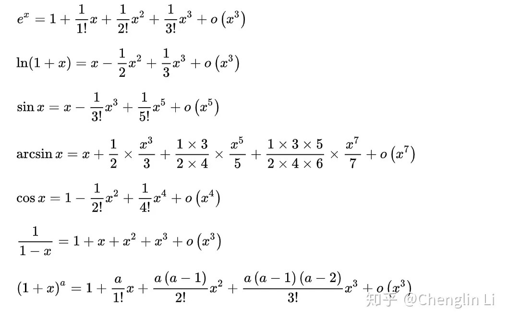

## 拉格朗日中值定理

如果$f(x)$满足以下条件：

- 在闭区间$[a,b]$上连续
- 在开区间$(a,b)$内可导

那么有如下结论：

在$(a,b)$上存在一点$\xi$，使得

$$
f'(\xi)=\dfrac{f(b)-f(a)}{b-a}
$$

## Taylor Formula

$$
f(x)=f(x-x_0)+f'(x_0)(x-x_0)+o(x)
$$

$$
f(x)=f(x-x_0)+\sum_{i=1}^{\infty}f^{(i)}(x_0)\dfrac{(x-x_0)^n}{i!}
$$

## 有理化

求极限时，若分子或分母上出现了根式做差，很多时候可以利用平方差公式进行分子或分母有理化，或三次方公式也可以。

## 导数定义

给定函数$f(x)$，若极限

$$
\lim_{\Delta x\to0}\dfrac{f(x_0\pm\Delta x)-f(x_0)}{\Delta x}
$$

存在，且相等则称其为$f(x)$在$x_0$处的导数，并称$f(x)$在$x=x_0$处可导。

## 导数的存在性和极限

1. $f(x)$在$x_0$处可导，则$f(x)$在$x_0$处连续。但$\lim_{x\to x_0}f'(x)$存在，不能导出则$f(x)$在$x_0$处连续
2. 如果$f(x_0)$在$x_0$附近的某空心邻域内可导且$f'(x)$在$x_0$处的极限为$A$，那么
    1. 如果$f'(x)$在$x_0$处的极限为$A$，$f(x)$在$x_0$处不连续，那么$f'(x_0)$不存在
    2. 如果$f'(x)$在$x_0$处的极限为$A$，$f(x)$在$x_0$处连续，那么$f'(x_0)=A$
    3. $f'(x)$在$x_0$处的极限等于无穷，那么$f'(x_0)$不存在
    4. 如果$f'(x)$在$x_0$处的极限不等于无穷，也不存在，此时不能确定$f'(x_0)$的存在性

## 高阶无穷小量

若$f,g$在$x_0$处的极限都是0，并且有

$$
\lim_{x\to x_0}\dfrac{f(x)}{g(x)}=0
$$

则称$f$为$g$在$x=x_0$处的高阶无穷小量，记做

$$
f(x)=o(g(x))
$$

## 一阶微分的形式不变性和高阶微分没有此性质

已知$y=f(u),u=\varphi(x)$，那么进行变量替换时有

$$
\mathrm dy=f'(u)\mathrm du=f'(u)\varphi'(x)\mathrm dx
$$

这称为一阶微分的形式不变性，而二阶微分不具有这个性质，而是

$$
\begin{aligned}
\mathrm d^2y
&=f'(u)\mathrm d^2u+f''(u)\mathrm du^2\\
&=\left[
f'(u)\varphi''(x)+f''(u)(\varphi'(x))^2\right]
\mathrm dx^2
\end{aligned}
$$

上式是通过将$u$看作以$x$为自变量的函数，而不是自变量，对一阶微分进行第二次微分得出的，进行第二次微分时，多出了一项，而且求微分的次数越高，多出的项越多。

如果$u$是自变量，那么依旧有

$$
\mathrm d^2y=f''(u)\mathrm du^2
$$

>[!note] 求微分时变量替换的问题
>所以在求微分时，只能一次一次求，不能一步到位。
>
>或者说，求导数运算被认为是两个微分符号相除，而是一整个微分算子$\dfrac{\mathrm d}{\mathrm dx}$作用在函数上。
>
>例如求$\dfrac{\mathrm d^2y}{\mathrm dx^2}$不能直接求$\dfrac{\mathrm d^2y}{\mathrm du^2}\cdot\left(\dfrac{\mathrm du}{\mathrm dx}\right)^2$
>
>因为它实际上是
>
>$$
>\dfrac{\mathrm d^2y}{\mathrm dx^2}=f''(u)\left(\dfrac{\mathrm du}{\mathrm dx}\right)^2+f'(x)\dfrac{\mathrm d^2u}{\mathrm dx^2}
>$$

但是，如果$u$是$x$的线性函数，那么高阶微分的形式不变性是成立的。这是因为如果$u$是$x$的线性函数，那么$u$对$x$的高阶导数（即大于一阶）都是 0.

## 渐近线

如果关于函数$f(x)$的极限

$$
\lim_{x\to+\infty}\dfrac{f(x)}{x}
$$

存在，那么这个函数有一个向$x$轴正方向的渐近线，其斜率$k$等于上述极限，截距

$$
b=\lim_{x\to+\infty}(f(x)-kx)
$$

>[!note]
>如果$f(x)$同时在$(c,+\infty)$上可导，那么由L'Hopital's Rule可以立即得到
>
>$$
>k=\lim_{x\to+\infty}f'(x)
>$$

上述讨论在$x\to-\infty$时也成立，函数在$x$轴负方向也有一条渐近线，如果正负两根渐近线重合，视为一条渐近线。
